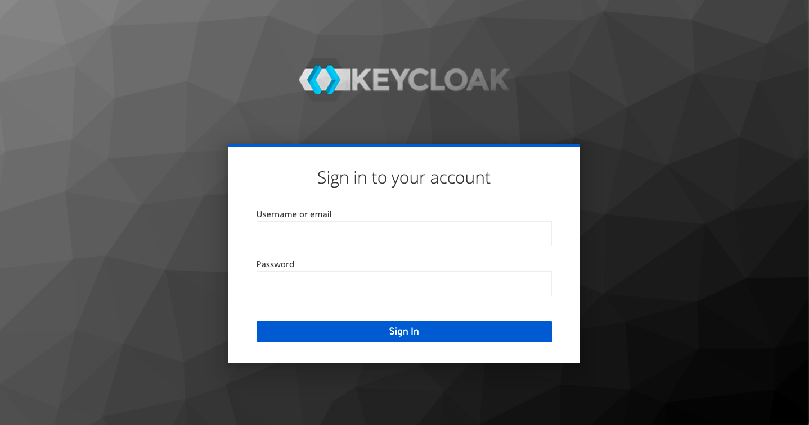
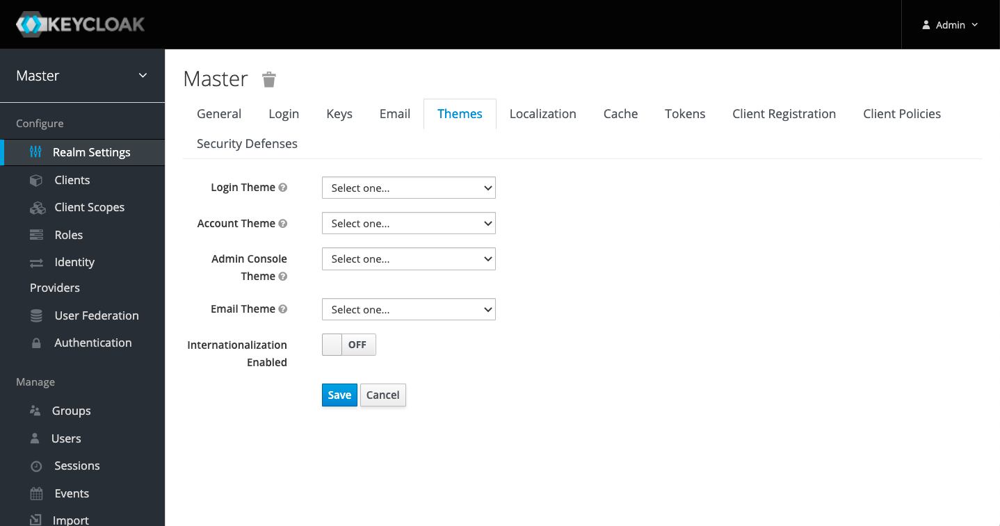
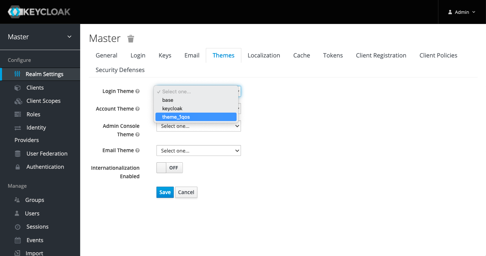
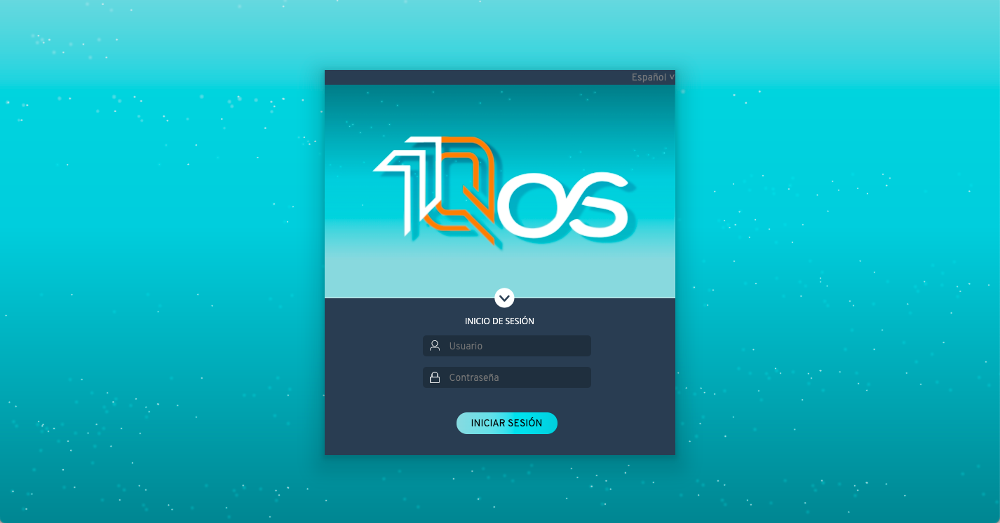

# keycloak-theme-1QoS
A Keycloak theme using theme-1QoS Template and Elements.

- [Using](#using)
- [Local Keycloak server](#local-keycloak-server)

## Using
To use it in your Keycloak realm:

1. Sign into your realm's admin console.

    

2. Go to the “Themes” tab in “Realm Settings”

    

3. Select “theme-1qos” as your login theme, and click on “Save”

    

The theme will now be used for all Keycloak log in screens on your realm - including logging in to the admin console. If you sign out, you should see the theme-1qos themed log in screen.

### Local Keycloak server
$ docker-compose up
